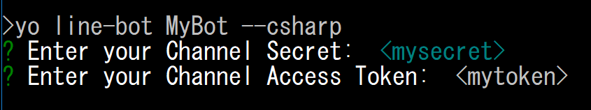

# LINE Bot template generator for yeoman
日本語は[こちら](./README_ja.md)

This repository contains generator of LINE Bot for yeoman. To use the package, install yeoman and the generator.

```
npm install -g yo
npm install -g generator-line-bot
```
This is optimized for Visual Studio Code, I strongly recommend using Visual Studio Code as editor. You can install it from [Visual Studio Code download](https://code.visualstudio.com/Download).

# Goal
The goal of this project is to let developer start LINE Bot developement super quick. It should be like this.
1. generate project by yeoman
1. Open via Visual Studio.
1. F5 to start debugging.

If you find any issue which doesn't meet this goal, please log issue or PR.

# How to use
1. To generate the application as "MyBot" with C# :

```script
yo line-bot MyBot --csharp
```
2. It also supports other languages. Change the last option 
- go 
- nodejs
- python
- ruby
If you select csharp, it will ask you project type, either Azure Function or Web API. You can specify it as option too.
```script
yo line-bot MyBot --csharp --webapi
```
3. It will ask you for ChannelSecret and Token. Pass the correct values.<br/><br/>


4. Open the generated folder via VSCode and you are good to go.
5. Visual Studio Code will let you know which extension you should install. Follow the instruction and install them as needed.
6. Simply press F5 will start debug the application.

# Other things you need to know

## C#
There are two project types. Azure Function or Web API.
### Azure Function
- It is Azure Function v2 application and default port is 7071.
- make sure you install azure function tools for dotnetcore. For further information, see [here](https://docs.microsoft.com/en-us/azure/azure-functions/functions-run-local)
### Web API
- It is dotnet core 2.0 Web API and default port is 5000.
### common
- make sure you install [C# extension](https://marketplace.visualstudio.com/items?itemName=ms-vscode.csharp)
- make sure you install [dotnet core 2](https://www.microsoft.com/net/download/windows)
- The template uses Azure Blog Storage for additional features.

## Node.js
- by default, it uses port 3000 when you debug locally. See index.js for more detail.
```javascript
const port = process.env.PORT || 3000;
app.listen(port, () => {
  console.log(`listening on ${port}`);
});
```
## golang
- make sure you installed [golang](https://golang.org/dl/) 
- make sure you install [Go extension](https://marketplace.visualstudio.com/items?itemName=lukehoban.Go).
- make sure you configured PATH to go command.
- by default, it uses port 8000 when you debug locally. See .vscode/launch.json for detail.

## python
- makre sure you installed [python](https://www.python.org/downloads/)
- make sure you install [Python extension](https://marketplace.visualstudio.com/items?itemName=ms-python.python)
- make sure you configured PATH to python and pip command.
- by default, it uses port 8000 when you debug locally. see app.py for more detail.
```python
arg_parser.add_argument('-p', '--port', default=8000, help='port')
```

## Ruby 
- makre sure you installed [Ruby](https://www.ruby-lang.org/en/documentation/installation/)
- make sure you installed [Ruby extension](https://marketplace.visualstudio.com/items?itemName=rebornix.Ruby)
- make sure you configured PATH to Ruby and Gem command.
- by default, it uses port 4567 when you debug locally. see app.rb for more detail.
```ruby
set :port, 4567
```

## Other resources
I will write detail step by step blog later.